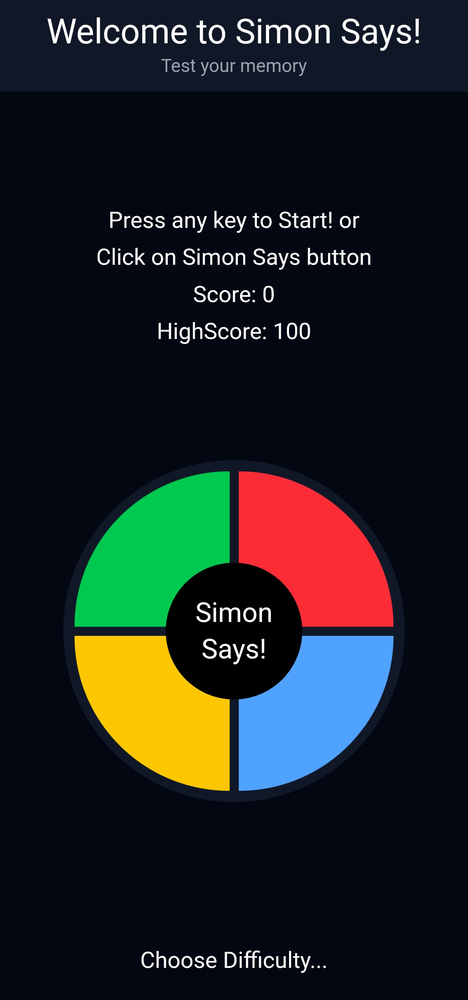
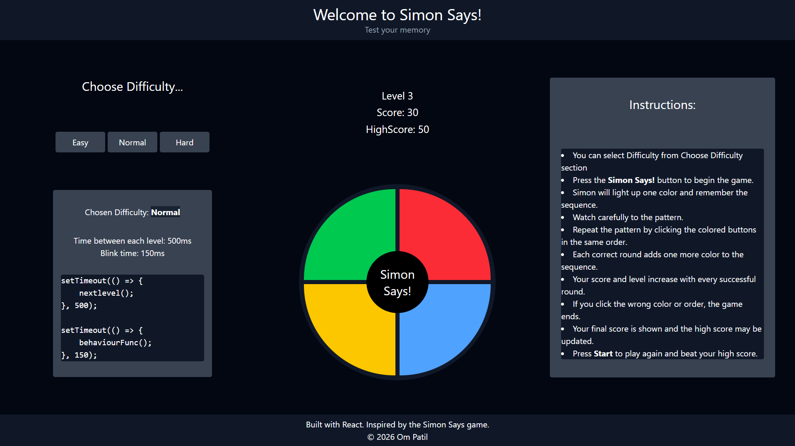
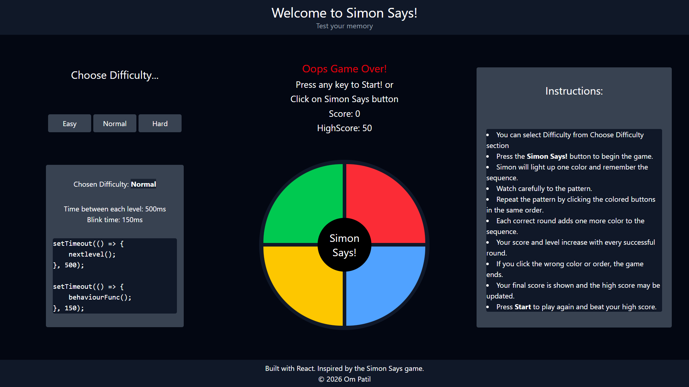

# 🎮 Simon Says | Memory Game

A responsive **Simon Says memory game** built using **React** and **Tailwind CSS**.  
Test your memory by repeating the color sequence generated by Simon — the sequence grows longer with every correct round.

---

## 🚀 Live Demo

🔗 https:.vercel.app

---

## 📸 Screenshots

### Start Screen

<p align="center">
  
  
</p>

### Gameplay



### Game Over



---

## ✨ Features

- 🎯 Classic Simon Says gameplay
- 🧠 Increasing difficulty with each level
- 🎨 Visual feedback and smooth interactions
- 📱 Fully responsive (mobile, tablet, desktop)
- ⚡ Fast performance with Vite
- 🧼 Clean and modern UI

---

## 🛠️ Tech Stack

- **React** (Hooks)
- **Tailwind CSS**
- **Vite**
- **JavaScript (ES6+)**

---

## 📖 How to Play

1. Press any key or click the **Simon Says** button to start.
2. Simon will highlight a color — remember the sequence.
3. Repeat the sequence by clicking the colored buttons in the same order.
4. Each correct round adds a new color to the sequence.
5. If you click the wrong color or order, the game ends.
6. Try again and beat your high score!

---

## 📦 Installation & Setup

1. Navigate to the project directory:

```bash
cd SimonSays
```

2. Install dependencies:

```bash
npm install
```

3. Run the development server:

```bash
npm run dev
```

4. Open in your browser:

```txt
http://localhost:5173
```

## 📁 Project Structure

```txt
SimonSays/
├── node_modules/
├── public/
├── screenshots/
├── src/
│   ├── assets/
│   ├── Components/
│   │   ├── Header.jsx
│   │   └── Footer.jsx
│   ├── Pages/
│   │   └── SimonSays.jsx
│   ├── App.jsx
│   ├── App.css
│   ├── index.css
│   └── main.jsx
├── .gitignore
├── eslint.config.js
├── index.html
├── package.json
├── package-lock.json
├── README.md
└── vite.config.js

```

## 📈 Future Improvements

- 🔊 Add sound effects
- 🏆 Persistent high score using localStorage
- 🎚️ Difficulty level customization
- 🎨 Theme / color customization

## 👨‍💻 Author

Om Patil

- GitHub: https://github.com/om-patil25
- LinkedIn: https://linkedin.com/in/om-patil25

## 📄 License

- This project is created for learning and personal use.

## ⭐ If you like this project, consider giving it a star!
